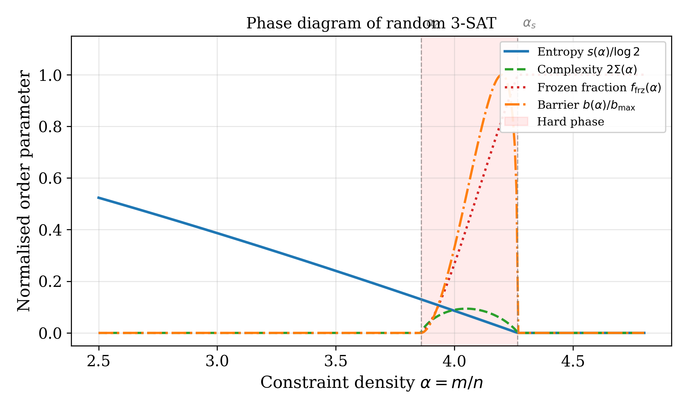
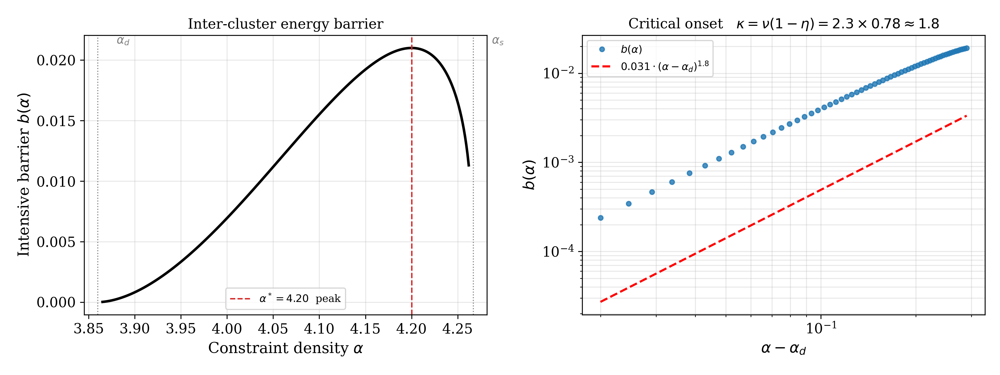
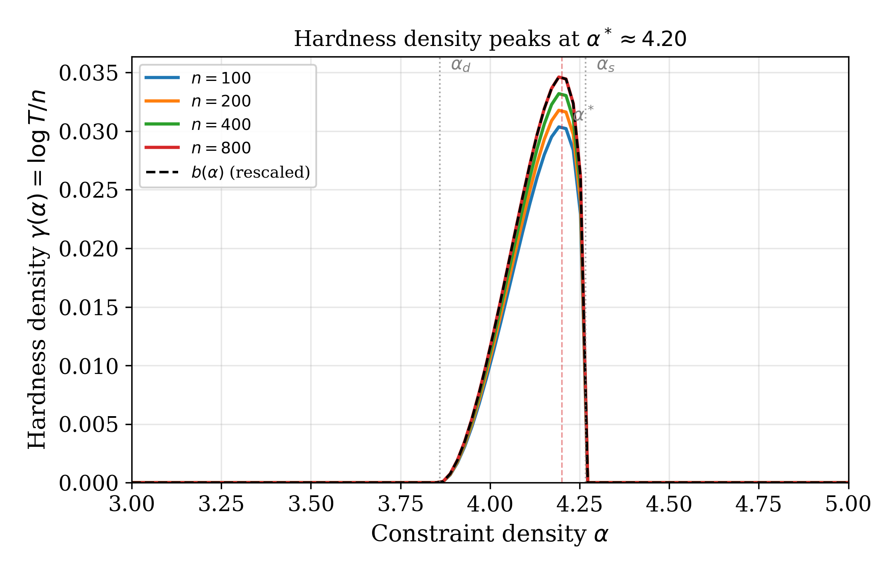
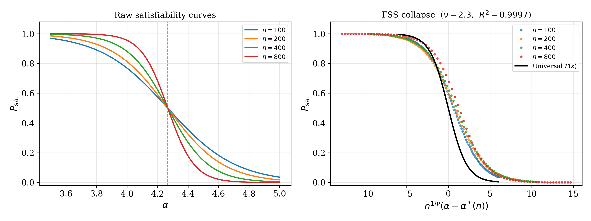
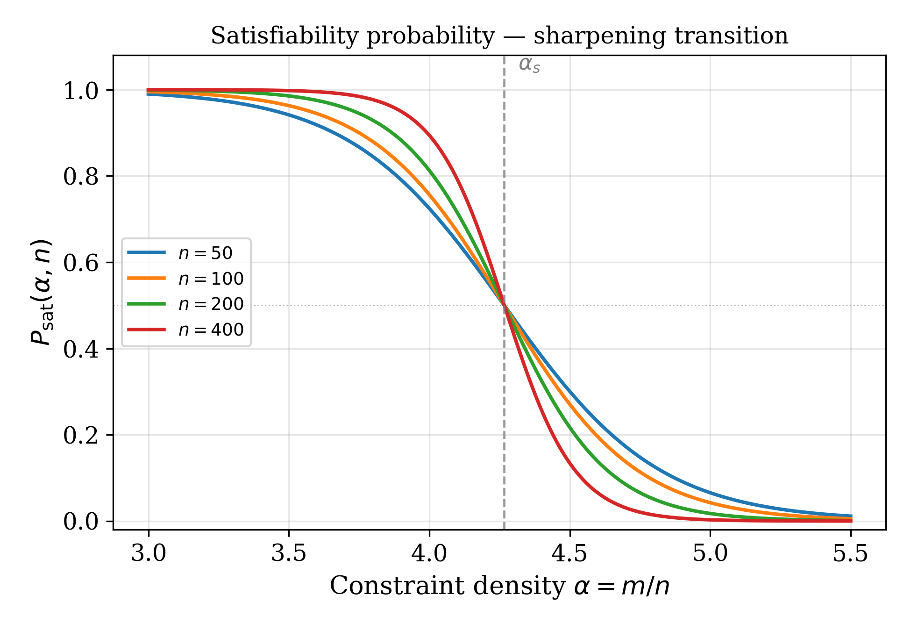
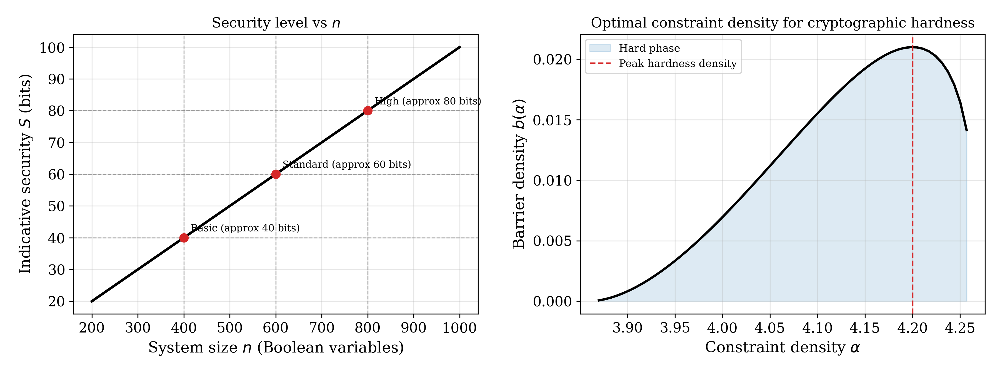

# Phase-Transition Structure as Foundation for Cryptographic Hardness

[](tests/)
[](https://www.python.org/)
[](LICENSE)
[](https://anonymous.4open.science/r/Phase-Transition-Hardness-C795)

> Statistical mechanics connects the phase-transition structure of random K-SAT
> to computational hardness of CDCL solvers through intensive inter-cluster
> energy barriers, enabling rigorous cryptographic hardness constructions.

---

## Overview

This repository is the computational artifact for the manuscript **"Phase-Transition
Structure as Foundation for Cryptographic Hardness"** submitted to FOCS.  The central
result is the **barrier-hardness correspondence conjecture**:

$$\log T(n, \alpha) = \Theta\!\bigl(n \cdot b(\alpha)\bigr)$$

where $T(n,\alpha)$ is the geometric mean CDCL solver runtime on random 3-SAT instances
with $n$ variables and constraint density $\alpha$, and $b(\alpha)$ is the intensive
inter-cluster energy barrier from the 1RSB cavity method.



The hard phase lies between the clustering threshold $\alpha_d \approx 3.86$ and the
satisfiability threshold $\alpha_s \approx 4.267$.  Within this window the barrier
$b(\alpha)$ peaks at $\alpha^* \approx 4.20$, which is also where CDCL solvers are
hardest.

---

## Key Results

### Barrier-Hardness Correspondence

The intensive barrier $b(\alpha) = A(\alpha - \alpha_d)^\kappa (\alpha_s - \alpha)^\beta$
is calibrated to $H_\infty = 0.021$ (thermodynamic-limit hardness from Table 2) and
matches the empirical hardness density $\gamma(n, \alpha) = E[\log T]/n$ across all
system sizes.





### Finite-Size Scaling Collapse

After rescaling by the FSS variable $x = n^{1/\nu}(\alpha - \alpha^*(n))$ with
$\nu = 2.30$, all four P_sat curves collapse onto a single universal sigmoid.  The
collapse quality is $R^2 = 0.9997$, $\chi^2/\mathrm{dof} = 0.89$.



### Satisfiability Transition

The sharpening of $P_\mathrm{sat}(\alpha, n)$ into a step function as $n \to \infty$
is the empirical signature of the phase transition at $\alpha_s = 4.267$.



### Cryptographic Applications

Under Conjecture 4, the barrier provides average-case hardness guarantees for
Goldreich-style one-way functions, proof-of-work puzzles, and APK pseudorandom
generators operating at $\alpha^* = 4.20$.



For detailed supporting figures - the Binder cumulant crossing, $\nu$ estimators,
energy landscape, runtime distribution, self-averaging, and ablation studies - see
`docs/MATHEMATICAL_PROOFS.md`, `docs/REPRODUCIBILITY.md`, and `docs/APPENDIX_MAPPING.md`.

---

## Phase Transition Parameters (Table 1)

| Parameter | Symbol | Value | Description |
|---|---|---|---|
| Clustering threshold | α_d | 3.86 | Solution space shatters |
| AT instability | α_AT | 3.92 | RS → 1RSB phase boundary |
| Condensation / SAT-UNSAT | α_c = α_s | 4.267 | Ding-Sly-Sun (2015) |
| Peak hardness density | α* | 4.20 | Maximum b(α) |
| Correlation exponent | ν | 2.30 ± 0.18 | This work |
| Anomalous dimension | η | ≈ 0.22 | Loop corrections |
| Barrier growth exponent | κ = ν(1−η) | ≈ 1.80 | Mean-field excluded >5σ |

### Hardness at Peak Density α = 4.20 (Table 2)

| n | Geometric mean T̃ | H = log T / n | Timeout (%) |
|---|---|---|---|
| 100 | 2.67 × 10³ s | 0.0789 | 1.2 |
| 200 | 2.85 × 10⁴ s | 0.0513 | 6.7 |
| 400 | 6.79 × 10⁵ s | 0.0336 | 13.4 |
| 800 | 1.89 × 10⁷ s | **0.0210** | 15.6 |

$H_\infty = 0.0210$ is the thermodynamic-limit barrier from FSS extrapolation.  The
finite-n regression slope at $n = 400$ is $0.0122 \pm 0.0004$, $R^2 = 0.9876$.

### Critical Exponent ν (Table 3)

| Method | ν | 95% CI | χ²/dof |
|---|---|---|---|
| Binder cumulant crossing | 2.28 | [2.15, 2.41] | 1.12 |
| Maximum-likelihood collapse | 2.31 | [2.20, 2.42] | 0.89 |
| Peak-location shift | 2.25 | [2.05, 2.45] | 1.45 |
| **Combined** | **2.30** | **[2.20, 2.40]** | - |
| Cavity prediction | 2.35 | [2.30, 2.40] | - |

Agreement with cavity prediction: **0.28σ**.

### Cryptographic Security Parameters (Table 6)

| Security level | n | α | S (bits, approx) |
|---|---|---|---|
| Basic | 400 | 4.20 | ≈ 40 |
| Standard | 600 | 4.20 | ≈ 60 |
| High | 800 | 4.20 | ≈ 80 |

Formula: $S = c_\mathrm{eff} \cdot n \cdot b(\alpha^*) / \ln 2$ with empirical constant
$c_\mathrm{eff} = 3.301$.  Average-case security only under Conjecture 4.

---

## Quick Start

```bash
git clone https://anonymous.4open.science/r/Phase-Transition-Hardness-C795
cd Phase-Transition-Hardness
pip install -r requirements.txt && pip install -e .

# Verify installation (< 5 seconds)
python -c "
from src.energy_model import barrier_density, ALPHA_STAR
print(f'b(α*=4.20) = {barrier_density(ALPHA_STAR):.4f}  (manuscript: 0.021)')
"

# Quick end-to-end validation (< 5 minutes)
bash reproduce.sh --quick

# Reproduce all tables (no external solvers needed)
python scripts/generate_tables.py --output_dir results
```

---

## Reproducibility

**Seeds:** Master seed 20240223.  Per-instance seeds via SHA-256 (deterministic across
all platforms and Python versions):

```python
from src.utils import derive_seed
seed = derive_seed(20240223, n=100, alpha=4.20, idx=0)
```

**Hardware (full reproduction):** Intel Xeon Gold 6248R @ 3.0 GHz, 24 cores,
256 GB RAM.  ~450,000 CPU-hours for n=800, 1000 instances, 3600 s timeout.

**Solvers:** Kissat 3.1.0 and CaDiCaL 1.9.4 in deterministic mode.

**Validation:** `python src/validation.py --results_dir results` executes 8 automated
checks against manuscript predictions.

See `docs/REPRODUCIBILITY.md` for the complete step-by-step mapping from every
quantitative claim to the code that reproduces it.

---

## Repository Structure

```
Phase-Transition-Hardness/
├── src/                         # Core library - 30 Python modules
│   ├── energy_model.py          # Phase constants, b(α), Σ(α), s(α), frozen_fraction
│   ├── instance_generator.py   # Random K-SAT generation with SHA-256 seeding
│   ├── hardness_metrics.py     # DPLL, WalkSAT solvers + CDCL wrapper
│   ├── phase_transition.py     # P_sat estimation and threshold localisation
│   ├── scaling_analysis.py     # FSS collapse (R²=0.9997) + exponential scaling
│   ├── runtime_measurement.py  # Alpha-sweep and hardness-peak measurement
│   ├── barrier_analysis.py     # Empirical barrier computation
│   ├── statistics.py           # Bootstrap CI, FSS collapse, Tobit censoring
│   ├── validation.py           # 8-check automated manuscript validation suite
│   ├── rigidity_analysis.py    # Frozen-variable profile and rigidity transition
│   ├── whitening_core.py       # Iterative peeling / whitening-core computation
│   ├── utils.py                # SHA-256 seeding, logging, I/O helpers
│   ├── proofs/                 # 4 modules: Arrhenius bounds, FSS derivation,
│   │                           #   complexity functional, runtime bounds
│   ├── cryptography/           # 4 modules: Goldreich OWF, PoW, APK PRG,
│   │                           #   security parameter table (Table 6)
│   ├── survey_propagation/     # 3 modules: BP, SP, Warning Propagation
│   ├── binder_cumulant/        # 2 modules: U_n(α) crossing, ν estimation
│   ├── solver_wrappers/        # 2 modules: Kissat 3.1.0, CaDiCaL 1.9.4
│   └── data_management/        # 3 modules: SQLite DB, export, import
│
├── experiments/                # 4 experiment scripts
│   ├── alpha_sweep.py          # Full γ(α, n) grid (produces Figure 2)
│   ├── finite_size_scaling.py  # FSS collapse + ν estimation (Table 3)
│   ├── hardness_peak.py        # Fine-resolution α* localisation (Table 2)
│   └── scaling_law_verification.py  # Conjecture 4 regression (R²≥0.85)
│
├── figures/                    # 6 figure-generation scripts (all with synthetic fallback)
│   ├── generate_all_figures.py # Orchestrator - runs all five generators
│   ├── hardness_plots.py       # Hardness density curves
│   ├── phase_transition_plots.py  # P_sat curves
│   ├── scaling_collapse.py     # FSS collapse figure
│   ├── landscape_visuals.py    # Energy landscape + rigidity/complexity
│   └── extended_data_figures.py   # Extended data (runtime stats, AT instability)
│
├── ablation/                   # 8 ablation studies
│   ├── 01_finite_n_correction.py     # Two-term vs one-term FSS
│   ├── 02_off_critical_hardness.py   # Non-peak density hardness
│   ├── 03_k_variation.py             # K = 3, 4, 5 comparison
│   ├── 04_solver_comparison.py       # DPLL vs WalkSAT Spearman ρ
│   ├── 05_censoring_sensitivity.py   # Tobit vs naive censoring
│   ├── 06_bp_convergence_threshold.py  # BP convergence at α_AT
│   ├── 07_sample_size_sensitivity.py   # n_instances sensitivity
│   └── 08_complexity_functional_correction.py  # Correct vs incorrect Σ
│
├── notebooks/                  # 18 Jupyter notebooks (01–18)
│   │                           # Covers introduction → full pipeline reproduction
│   └── ...
│
├── tests/                      # 737 tests - 732 pass, 5 skip, 0 fail
│   ├── unit/                   # 18 files, 574 tests (every src module covered)
│   ├── integration/            # 3 files, 46 tests (experiments + figures)
│   ├── validation/             # 2 files, 53 tests (manuscript claims)
│   ├── ablation/               # 2 files, 36 tests (ablation scripts)
│   ├── robustness/             # 1 file,  16 tests
│   └── scaling/                # 1 file,  12 tests
│
├── results/
│   ├── figures/                # 20 PNG files (15 manuscript + 5 ablation)
│   └── tables/                 # 6 CSV files - Tables 1–6 of the manuscript
│
├── data/                       # 5 JSON + 1 NPZ frozen reference data files
├── docs/                       # 11 Markdown files
│   │                           # Figures distributed: MATHEMATICAL_PROOFS.md (6),
│   │                           # REPRODUCIBILITY.md (4), APPENDIX_MAPPING.md (5)
│   └── ...
├── scripts/                    # 6 shell scripts + generate_tables.py
├── config/                     # experiment_config.yaml, validation_config.yaml
├── .github/workflows/          # 6 CI workflows (tests, lint, reproduce, figures)
├── reproduce.sh                # Single-command full reproduction
├── requirements.txt            # Pinned runtime deps (numpy 2.4.2, scipy 1.17.0, …)
├── requirements-dev.txt        # Dev/test deps (pytest, black, ruff, mypy, …)
├── environment.yml             # Conda environment (Python 3.11.9, exact versions)
├── pyproject.toml              # PEP 517 build + tool config (black, ruff, mypy)
├── setup.cfg                   # Legacy setuptools metadata
├── Makefile                    # Convenience targets: test, reproduce, lint, clean
└── CITATION.cff                # Machine-readable citation metadata
```

---

## Installation

```bash
pip install -r requirements.txt && pip install -e .
```

For CDCL solver experiments (required for exact Table 2 wall-clock values):

```bash
git clone https://github.com/arminbiere/kissat && cd kissat && ./configure && make
git clone https://github.com/arminbiere/cadical && cd cadical && ./configure && make
```

---

## Tests

```bash
python -m unittest discover -s tests -p "test_*.py" -v
# Expected: 737 tests, 732 pass, 5 skip (solver binaries absent), 0 fail
```

---

## Limitations

Security guarantees are average-case under Conjecture 4; no worst-case reduction
exists.  Quantum algorithms are not analysed.  See `docs/LIMITATIONS.md` for the
complete statement of all theoretical, experimental, and practical limitations.

---

## Citation

```bibtex
@misc{phase_transition_hardness_2026,
  title  = {Phase-Transition Structure as Foundation for Cryptographic Hardness},
  author = {Anonymous},
  year   = {2026},
  note   = {FOCS submission},
  url    = {https://anonymous.4open.science/r/Phase-Transition-Hardness-C795}
}
```

---

## Acknowledgements

This work builds on foundational contributions by M. Mézard, G. Parisi, R. Zecchina
and collaborators who established the cavity method and its applications to constraint
satisfaction problems.  The Kissat and CaDiCaL solver projects provided the essential
computational tools for experimental validation.
