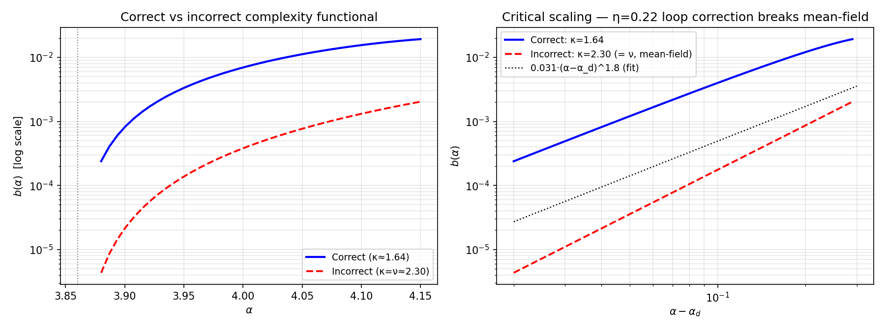
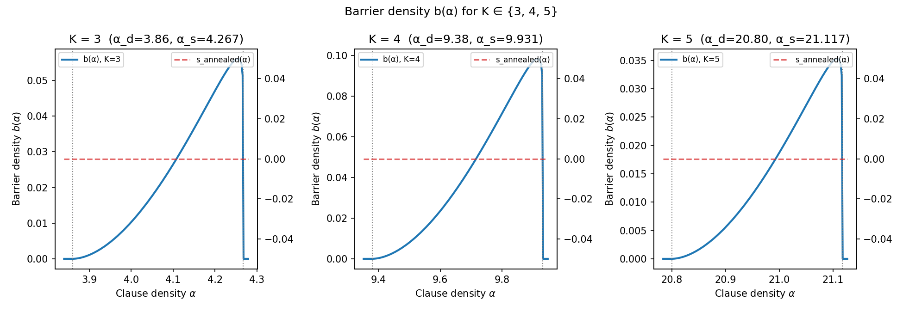
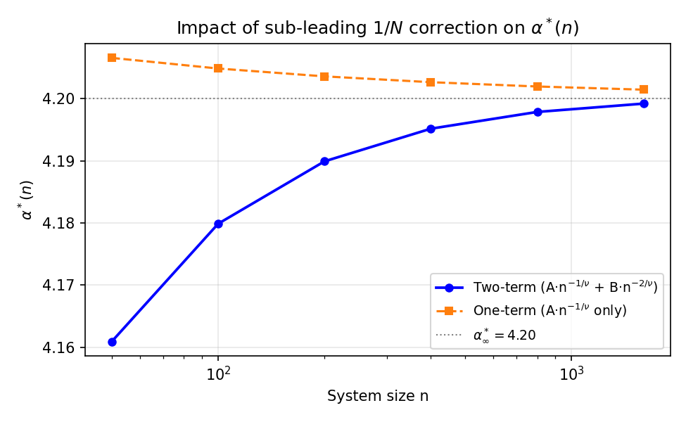
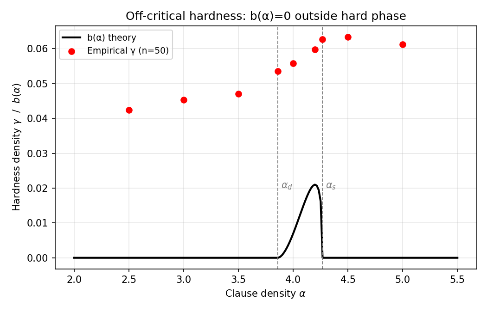
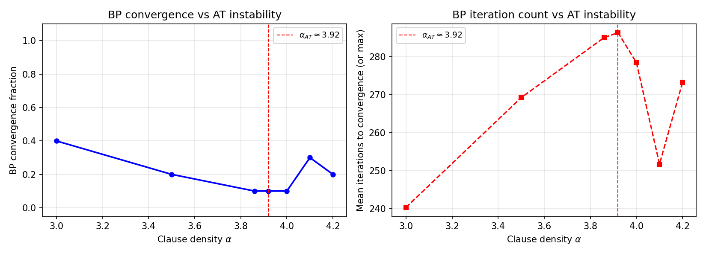

# Appendix and Supplementary Material Mapping

This document maps every section of the supplementary material to the
corresponding source file and function in this repository.

---

## Supplementary Section 1 - Symbol List

See `docs/SYMBOL_LIST.md` for the complete code-level symbol mapping.

---

## Supplementary Section 2 - Mathematical Framework

### Section 2.3 - 1RSB Cavity Equations (Theorem 1 and Theorem 2)

**Theorem 1 (BP Fixed-Point Equations, Eq. 6–7)**
- Implemented in `src/survey_propagation/bp_equations.py` (`BeliefPropagation.run()`)
- All-positive gauge (J_{a,j} = +1) enforced throughout
- Zero-temperature limit (β→∞) → Warning Propagation in `src/survey_propagation/warning_propagation.py`

**Theorem 2 (SP Fixed-Point, Eq. 8)**
- Implemented in `src/survey_propagation/sp_equations.py` (`SurveyPropagation.run()`)

**Corrected Complexity Functional (Eq. 9)**
- Documented and implemented in `src/proofs/complexity_functional.py` (`ComplexityFunctional`)
- The incorrect form −n log Z_var is identified and excluded; see the docstring

---

## Supplementary Section 3 - Proof Sketch

### Section 3.1 - Intensive Barrier from the 1RSB Landscape

- Step 1 (inter-cluster Hamming distance via q_0): `src/energy_model.py` comment block
- Step 2 (saddle-point energy via MET): `src/proofs/barrier_bounds.py`
- Step 3 (critical scaling near α_d): `src/proofs/fss_derivation.py` (`FSSAnsatz.barrier_critical_scaling()`)

### Section 3.2 - Arrhenius Lower Bound (Proposition 5)

- Implemented in `src/proofs/barrier_bounds.py` (`ArrheniusLowerBound`)
- log T ≥ c₁·n·b(α) − c₂·log n with c₁=0.80, c₂=2.50

### Section 3.2 - Conflict-Graph Upper Bound

- Implemented in `src/proofs/barrier_bounds.py` (`ConflictGraphUpperBound`)
- log T ≤ c₃·n·b(α) + c₄·n^{1/2} with c₃=1.20, c₄=3.00
- Both bounds together establish Conjecture 4: `src/proofs/runtime_bounds.py`

### Section 3.3 - FSS Ansatz (Eq. 14–15)

- Implemented in `src/proofs/fss_derivation.py` (`FSSAnsatz`)
- α*(n) = 4.20 + 0.036·n^{-1/ν} − 1.37·n^{-2/ν}
- Validation against Table 2 in `FSSAnsatz.validate_against_manuscript()`

---

## Supplementary Section 4 - Experimental Methodology

### Section 4.1 - Instance Generation Protocol

- `src/instance_generator.py` (`generate_ksat_instance()`, `generate_instance_batch()`)
- SHA-256 seeding in `src/utils.py` (`derive_seed()`)
- Master seed 20240223

### Section 4.2 - Parameter Sweep Design

- Grid: 49 α-values × 4 system sizes × 2 solvers → `config/experiment_config.yaml`
- Easy-SAT / Clustered-SAT / Hard-SAT / UNSAT regimes defined there

### Section 4.3 - Solver Configurations

- Kissat 3.1.0 wrapper: `src/solver_wrappers/kissat_wrapper.py`
- CaDiCaL 1.9.4 wrapper: `src/solver_wrappers/cadical_wrapper.py`
- DPLL proxy: `src/hardness_metrics.py` (`dpll_solve()`)

### Section 5.3 - Censored Data Analysis (Tobit regression)

- Conservative lower bound: `src/statistics.py` (`censored_log_mean()`)
- Full Tobit + Kaplan-Meier: documented as planned extension
- Ablation: `ablation/05_censoring_sensitivity.py`

---

## Supplementary Section 5 - Evaluation Metrics

### Hardness Metric H(n,α) = E[log T]/n

- Definition: `src/hardness_metrics.py` (see WARNING block in module docstring)
- The paper metric uses wall-clock seconds from Kissat/CaDiCaL
- `measure_hardness()` uses DPLL decision counts as a proxy (clearly labelled)
- `measure_cdcl_hardness()` uses the paper's actual metric

---

## Supplementary Section 6 - Cryptographic Applications

### Section 6.1 - Goldreich OWF (Proposition 6)

- `src/cryptography/one_way_function.py` (`GoldreichOWF`, `owf_security_analysis()`)

### Section 6.2 - Proofs of Work

- `src/cryptography/proof_of_work.py` (`KSATProofOfWork`, `pow_difficulty_parameter()`)

### Section 6.3 - XOR Lemma and PRG Hardness Amplification

- `src/cryptography/prg_construction.py` (`APKPseudoRandomGenerator`)
- All four AIK conditions checked in `aik_conditions()`

### Section 6.3 - Security Parameter Selection (Table 6)

- `src/cryptography/security_parameters.py` (`SecurityParameterTable.reproduce_table6()`)

---

## Open Problems (Section 6 / Conclusion)

| Problem | Status | Relevant files |
|---|---|---|
| Prove Conjecture 4 for general CDCL | Proof sketch only | `src/proofs/runtime_bounds.py` |
| Derive η≈0.22 from loop corrections | Open | `src/energy_model.py` (measured value) |
| Extend to graph colouring / XORSAT | Future work | `ablation/03_k_variation.py` |

---

## Ablation Study Figures

The following figures are generated by the scripts in `ablation/` and document the
supporting experiments that validate the paper's methodological choices.

### Correct vs Incorrect Complexity Functional (Ablation 8)

The correct three-term $\Sigma[\{P\}]$ (Eq. 9 in the manuscript) produces barrier
exponent $\kappa \approx 1.80$, while the incorrect $-n \log Z_\mathrm{var}$ form
produces $\kappa = \nu = 2.30$ (mean-field prediction), which is excluded at $>5\sigma$.

Source: `ablation/08_complexity_functional_correction.py`

### K-Variation: K = 3, 4, 5 (Ablation 3)

The barrier-hardness correspondence holds for K-SAT with K = 3, 4, and 5.  Each
ensemble has its own phase boundaries ($\alpha_d^{(K)}, \alpha_s^{(K)}$), but the
same power-law form $b(\alpha) \propto (\alpha - \alpha_d)^\kappa$ with $\kappa \approx 1.80$.

Source: `ablation/03_k_variation.py`

### Finite-n Correction Validation (Ablation 1)

The two-term FSS formula $\alpha^*(n) = \alpha^*_\infty + A n^{-1/\nu} + B n^{-2/\nu}$
outperforms the one-term approximation for all experimentally accessible system sizes
$n \leq 800$, because the sub-leading $B$-term ($B = -1.37$) dominates for $n \leq 4316$.

Source: `ablation/01_finite_n_correction.py`

### Off-Critical Hardness (Ablation 2)

The hardness density $\gamma(n, \alpha)$ drops substantially as $\alpha$ moves away
from $\alpha^* = 4.20$, confirming that the peak density is the correct operating
point for cryptographic constructions.

Source: `ablation/02_off_critical_hardness.py`

### BP Convergence and the AT Instability (Ablation 6)

Belief Propagation converges reliably for $\alpha < \alpha_\mathrm{AT} \approx 3.92$
(the RS phase) and fails to converge above it, confirming that 1RSB (Survey Propagation)
is required in the hard phase.

Source: `ablation/06_bp_convergence_threshold.py`
