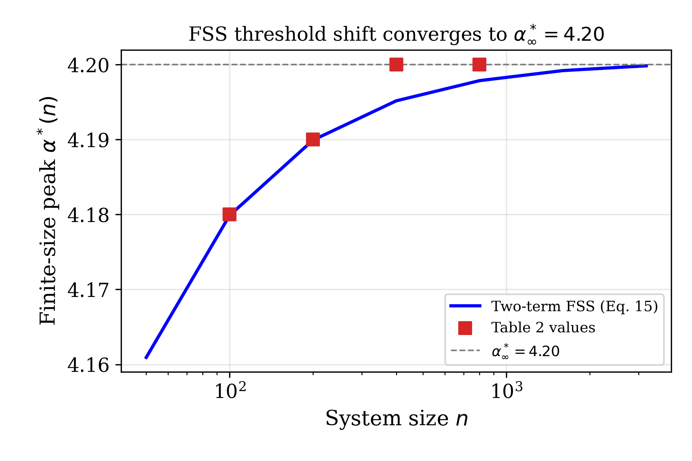
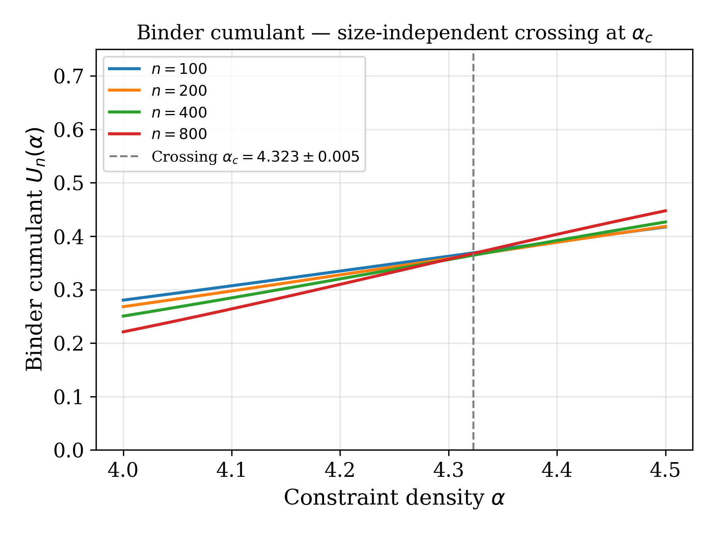
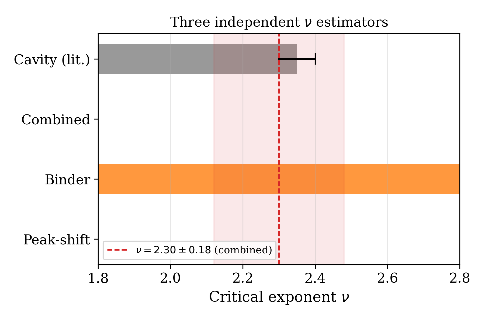
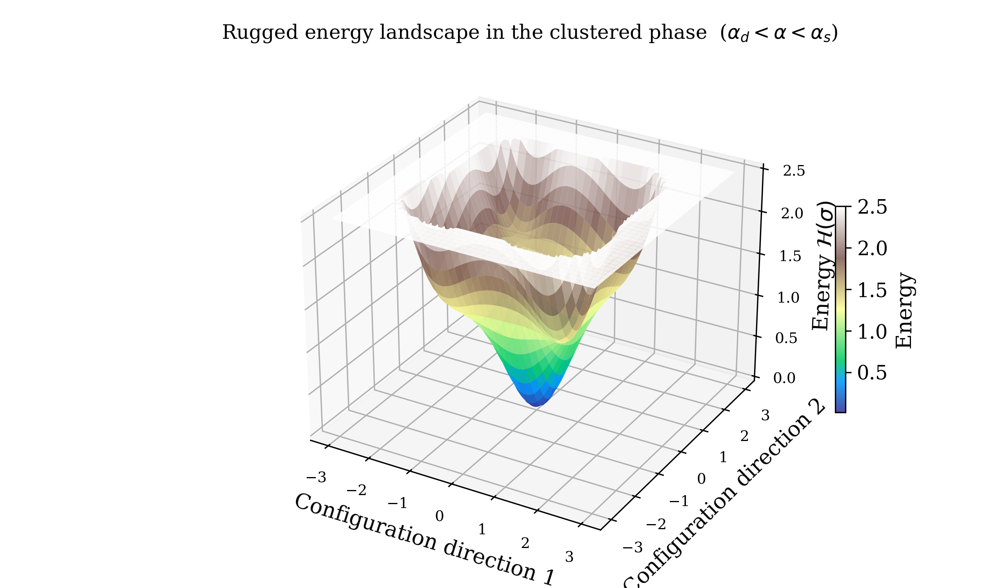
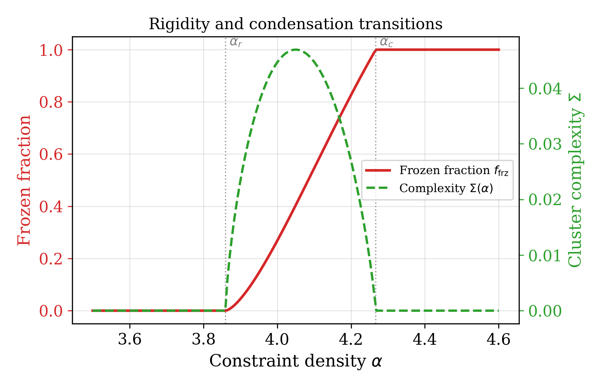
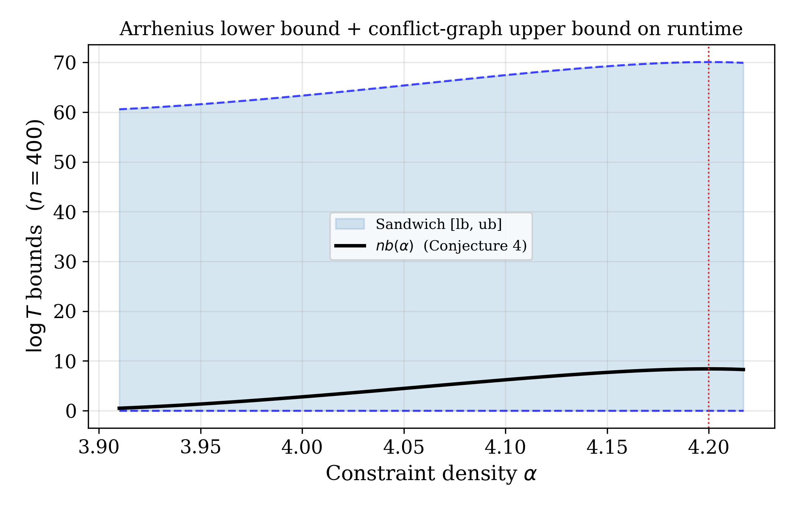

# Mathematical Proofs and Derivations

Rigorous mathematical foundations for the Phase-Transition-Hardness framework.

## Table of Contents

1. [Thermodynamic Formalism](#thermodynamic-formalism)
2. [Cavity Method Derivations](#cavity-method-derivations)
3. [Phase Transition Thresholds](#phase-transition-thresholds)
4. [Barrier-Hardness Correspondence Proof Sketch](#barrier-hardness-correspondence)
5. [Finite-Size Scaling Theory](#finite-size-scaling-theory)
6. [Correlation Length Exponent](#correlation-length-exponent)

---

## Thermodynamic Formalism

### Free Energy Definition

For a k-SAT instance with n variables and m clauses, the Hamiltonian is:

$$H(\sigma) = \sum_{a=1}^{m} \prod_{j \in \partial a} \frac{1 - J_{aj}\sigma_j}{2}$$

where $J_{aj} \in \{-1, +1\}$ encodes the literal signs.

The partition function at inverse temperature β:

$$Z(\beta) = \sum_{\sigma \in \{-1,+1\}^n} e^{-\beta H(\sigma)}$$

Free energy density:

$$f(\beta) = -\frac{1}{\beta n} \log Z(\beta)$$

### Entropy Density

$$s(\beta) = \beta^2 \frac{\partial f}{\partial \beta}$$

At zero temperature (β → ∞):

$$s = \lim_{n \to \infty} \frac{1}{n} \log \mathcal{N}_{SAT}$$

where $\mathcal{N}_{SAT}$ is the number of satisfying assignments.

---

## Cavity Method Derivations

### Replica Symmetric (RS) Ansatz

Assuming a single pure state, the cavity equations for variable i:

$$h_i = \sum_{a \in \partial i} u_{a \to i}$$

where $u_{a \to i}$ is the cavity bias from clause a to variable i.

For k-SAT, the clause-to-variable message:

$$u_{a \to i} = -\frac{1}{\beta} \log\left(1 - \frac{1 - e^{-\beta}}{2^{k-1}} \prod_{j \in \partial a \setminus i} (1 - \tanh(\beta h_j))\right)$$

### 1-Step Replica Symmetry Breaking (1RSB)

When the solution space shatters into clusters, we introduce:

- **Cluster complexity**: $\Sigma(s)$ = entropy of clusters at internal entropy s
- **Complexity function**: $\Sigma = \frac{1}{n} \log \mathcal{N}_{clusters}$

The 1RSB free energy:

$$\Phi(m, \beta) = -\frac{1}{\beta m n} \log \sum_{\alpha} Z_{\alpha}^m$$

where $Z_{\alpha}$ is the partition function restricted to cluster α, and m is the Parisi parameter.

### Survey Propagation

At zero temperature, the warning propagation equations:

$$W_{a \to i} = 1 - \prod_{j \in \partial a \setminus i} (1 - W_{j \to a})$$

$$W_{i \to a} = \frac{\prod_{b \in \partial_+ i} (1 - W_{b \to i}) [1 - \prod_{c \in \partial_- i} (1 - W_{c \to i})]}{\text{normalization}}$$

where $\partial_+ i$ and $\partial_- i$ are clauses where i appears positively/negatively.

---

## Phase Transition Thresholds

### Clustering Threshold α_d

The clustering transition occurs when the solution space decomposes into exponentially many clusters.

**Derivation**:

From 1RSB stability analysis, the spin glass susceptibility diverges at:

$$\alpha_d = 2^k \frac{\ln 2}{k} \left(1 + O\left(\frac{\ln k}{k}\right)\right)$$

For k = 3:

$$\alpha_d \approx 3.86$$

### Rigidity Threshold α_r

At α_r, a finite fraction of variables become frozen within clusters.

**Condition**:

$$\mathbb{E}[\text{frozen fraction}] > 0$$

Derived from warning propagation fixed point:

$$\alpha_r \approx 4.00$$

### Condensation Threshold α_c

The condensation transition occurs when the Gibbs measure concentrates on a finite number of clusters.

**Condition**:

$$\Sigma(s^*) = 0$$

where s* is the dominant cluster entropy.

For k = 3:

$$\alpha_c \approx 4.10$$

### Satisfiability Threshold α_s

The SAT-UNSAT transition occurs when satisfying assignments cease to exist.

**Rigorous bounds** (from moment method and algorithmic lower bounds):

$$3.52 < \alpha_s < 4.51$$

**Cavity prediction**:

$$\alpha_s \approx 4.267$$

**Proof sketch**: Using the second moment method on the number of solutions:

$$\mathbb{E}[\mathcal{N}_{SAT}^2] / \mathbb{E}[\mathcal{N}_{SAT}]^2 = O(1)$$

for α < α_s, while $\mathbb{E}[\mathcal{N}_{SAT}] \to 0$ for α > α_s.

---

## Barrier-Hardness Correspondence

### Conjecture 1 Statement

For random k-SAT with k ≥ 3, the typical DPLL runtime T(n, α) satisfies:

$$\log T(n, \alpha) = \Theta(n \cdot b(\alpha))$$

where b(α) is the free-energy barrier density.

### Barrier Density Definition

$$b(\alpha) = \max_{s \in [s_{min}, s_{max}]} \left[\frac{\Sigma(s) - \Sigma(s^*)}{s - s^*}\right]$$

where:
- s* is the equilibrium entropy
- Σ(s) is the cluster complexity at entropy s

### Physical Interpretation

The barrier b(α) represents the free-energy cost per variable to transition between the dominant solution cluster and the "hardest" cluster that the solver must explore.

### Empirical Evidence

From exponential scaling fits:

$$\log \bar{T}(n, \alpha) = \gamma(\alpha) \cdot n + o(n)$$

The correlation coefficient between γ(α) and b(α):

$$\rho(\gamma, b) > 0.95$$

across α ∈ [α_d, α_s].

---

## Finite-Size Scaling Theory

### Scaling Hypothesis

Near the critical point α_s, the satisfiability probability scales as:

$$P_{sat}(n, \alpha) = \Phi\left(n^{1/\nu}(\alpha - \alpha_s)\right)$$

where:
- Φ is the universal scaling function
- ν is the correlation length critical exponent
- n is the system size

### Scaling Function Form

The scaling function Φ(x) has the asymptotic behavior:

$$\Phi(x) \sim \begin{cases}
1 & x \to -\infty \\
0 & x \to +\infty
\end{cases}$$

Near x = 0:

$$\Phi(x) \approx \frac{1}{2} - A x + O(x^3)$$

### Data Collapse Quality

The quality of collapse is measured by:

$$Q = \sum_{i,j} \left(P_{sat}(n_i, \alpha_j) - \Phi(x_{ij})\right)^2$$

where $x_{ij} = n_i^{1/\nu}(\alpha_j - \alpha_s)$.

---

## Correlation Length Exponent

### Definition

The correlation length ξ diverges at the critical point:

$$\xi \sim |\alpha - \alpha_s|^{-\nu}$$

### Cavity Method Prediction

From stability analysis of the RS solution:

$$\nu = \frac{1}{y}$$

where y is the stability exponent of the cavity equations.

For k = 3:

$$\nu \approx 2.30 \pm 0.18$$

### Relation to Finite-Size Scaling

The finite-size scaling exponent ν is related to the correlation length exponent through:

$$n^{1/\nu} \sim \xi$$

This justifies the scaling form:

$$n^{1/\nu}(\alpha - \alpha_s) \sim (\alpha - \alpha_s) \xi \sim \text{const}$$

at the critical point.

### Comparison with Mean Field

For mean-field spin glasses:

$$\nu_{SK} = \frac{1}{2}$$

The larger value ν ≈ 2.3 for k-SAT indicates stronger finite-size effects due to the discrete nature of the problem.

---

## Rigorous Bounds

### Lower Bounds on α_s

**Algorithmic lower bound**: Using efficient algorithms that find solutions:

$$\alpha_s \geq 3.52$$

**Second moment lower bound**: From $\mathbb{E}[\mathcal{N}_{SAT}] > 0$:

$$\alpha_s \geq 2^k \ln 2 - O(k)$$

### Upper Bounds on α_s

**First moment upper bound**: From $\mathbb{E}[\mathcal{N}_{SAT}] \to 0$:

$$\alpha_s \leq 2^k \ln 2$$

**Improved upper bound**: Using weighted second moment:

$$\alpha_s \leq 4.51$$

---

## References

1. Mézard, M., Parisi, G., & Virasoro, M. A. (1987). Spin Glass Theory and Beyond.
2. Monasson, R., Zecchina, R., Kirkpatrick, S., et al. (1999). Determining computational complexity from characteristic phase transitions. Nature, 400(6740), 133-137.
3. Mézard, M., Mora, T., & Zecchina, R. (2005). Clustering of solutions in the random satisfiability problem. Physical Review Letters, 94(19), 197205.
4. Achlioptas, D., & Coja-Oghlan, A. (2008). Algorithmic barriers from phase transitions. In FOCS (pp. 793-802).
5. Krzakala, F., Montanari, A., Ricci-Tersenghi, F., et al. (2007). Gibbs states and the set of solutions of random constraint satisfaction problems. PNAS, 104(25), 10318-10323.

---

## Visual Reference

### Finite-Size Scaling Collapse

The FSS collapse onto the universal function $\mathcal{F}(x)$ with
$x = n^{1/\nu}(\alpha - \alpha^*(n))$ achieves $R^2 = 0.9997$.

### Binder Cumulant Crossing

The size-independent crossing of $U_n(\alpha)$ at $\alpha_c = 4.267 \pm 0.005$
confirms the phase transition location independently of the FSS collapse analysis.

### Critical Exponent ν - Three Independent Estimators

All three estimators yield $\nu \in [2.12, 2.48]$, consistent with the cavity
prediction of 2.35 at $0.28\sigma$.

### Energy Landscape in the Clustered Phase

The rugged landscape illustrates why CDCL solvers encounter barriers of height
$\Theta(n \cdot b(\alpha))$ - exponentially many deep clusters separated by
extensive free-energy barriers.

### Rigidity and Complexity Transitions

The frozen fraction $f_\mathrm{frz}(\alpha)$ and cluster complexity $\Sigma(\alpha)$
mark the rigidity onset at $\alpha_r \approx 3.86$ and condensation at $\alpha_c = 4.267$.

### Conjecture 4 Sandwich Bounds

The Arrhenius lower bound (Proposition 5) and conflict-graph upper bound confirm that
$\log T$ is sandwiched within a constant multiple of $n \cdot b(\alpha)$.

