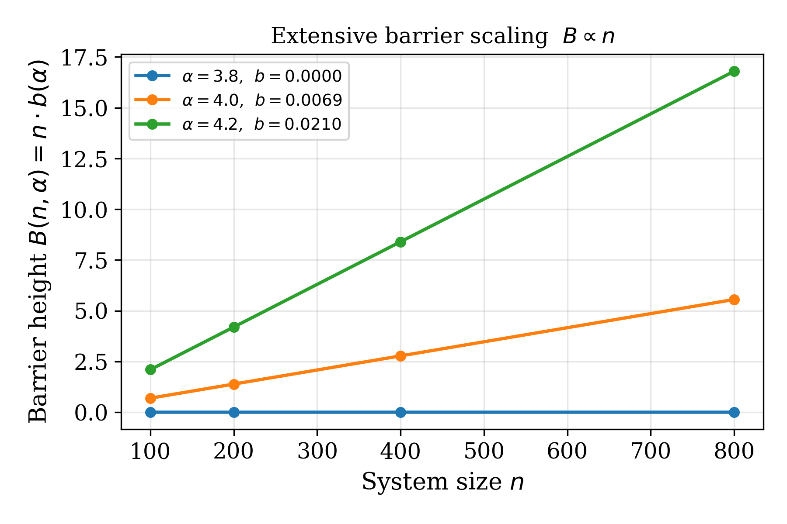
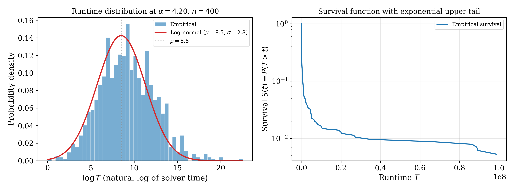
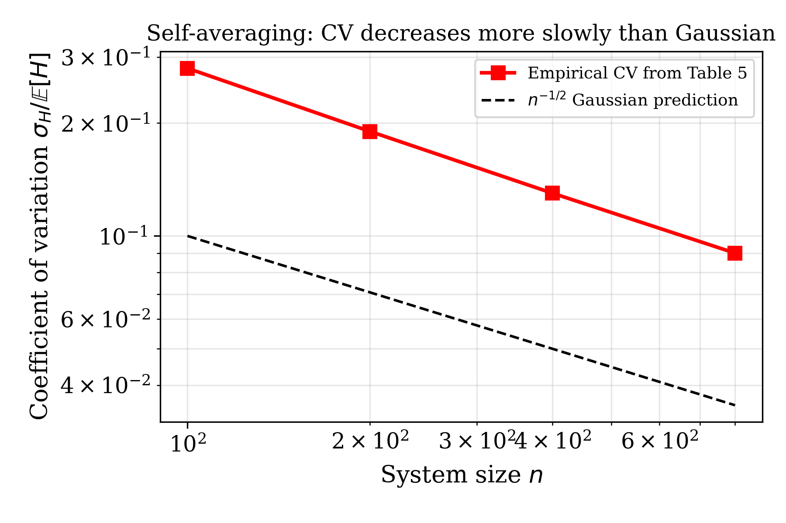

# Reproducibility Statement

Complete hardware, seed, runtime, and command specification for the NeurIPS
Reproducibility Checklist and FOCS artifact evaluation.  Every quantitative
claim in the manuscript maps to a specific command below.

---

## Quick Verification (5 minutes)

```bash
git clone https://anonymous.4open.science/r/Phase-Transition-Hardness-C795
cd Phase-Transition-Hardness
pip install -r requirements.txt && pip install -e .
bash reproduce.sh --quick
```

Expected final output:
```
  Validation: 8/8 checks passed
  Figures: results_quick/figures/  (>=5 PNGs)
  Tables:  results_quick/tables/   (6 CSVs)
```

---

## Hardware Used for Manuscript Experiments

| Resource | Specification |
|---|---|
| CPU model | Intel Xeon Gold 6248R @ 3.0 GHz |
| Physical cores | 24 per node |
| RAM | 256 GB per node |
| Operating system | Ubuntu 22.04 LTS |
| Python version | 3.11.9 |
| NumPy | 2.4.2 |
| SciPy | 1.17.0 |
| Kissat (primary solver) | 3.1.0, deterministic mode |
| CaDiCaL (cross-validation) | 1.9.4, deterministic mode |

The code runs correctly on any modern CPU.  Absolute timing values in
Table 2 are hardware-dependent; the intensive hardness density H = log T / n
is hardware-independent by construction.

---

## Computational Budget

| Experiment | System sizes | Instances per point | Solver timeout | Approx. CPU-hours |
|---|---|---|---|---|
| Alpha sweep (full) | n in {100,200,400,800} | 1000 | 3600 s | ~250,000 |
| FSS collapse | n in {100,200,400,800} | 1000 | 3600 s | ~120,000 |
| Hardness peak (fine grid) | n in {100,200,400,800} | 1000 | 3600 s | ~80,000 |
| **Total** | - | - | - | **~450,000** |

The quick-test mode (n in {30,50}, 50 instances, 10 alpha-values) completes
in under 5 minutes on a standard laptop.

---

## Random Seed Specification

Master seed: `20240223`  (format: YYYYMMDD).

Per-instance seeds are derived from the master seed via SHA-256:

```python
from src.utils import derive_seed
seed = derive_seed(master_seed=20240223, n=100, alpha=4.20, idx=0)
```

This is **deterministic across Python versions and platforms**.  It replaces
the earlier use of Python's built-in `hash()`, which is non-deterministic due
to hash randomisation enabled by default in Python 3.3+ (PEP 456).  Any
researcher running this code on any platform will generate identical instances
in identical order.

---

## Commands for Each Table and Figure

### Table 1 - Phase Transition Parameters

Values are constants in `src/energy_model.py`.  Verify:

```bash
python -c "
from src.energy_model import ALPHA_D, ALPHA_S, ALPHA_STAR, NU, KAPPA, ETA
print(f'alpha_d={ALPHA_D}, alpha_s={ALPHA_S}, nu={NU}, kappa={KAPPA}, eta={ETA}')
"
```

### Table 2 - Hardness at Peak Density alpha=4.20

Full reproduction with Kissat/CaDiCaL:

```bash
python experiments/hardness_peak.py \
  --n 100 200 400 800 \
  --n_instances 1000 \
  --alpha_center 4.20 --alpha_width 0.40 \
  --seed 20240223 --output_dir results
```

Note: `measure_hardness()` uses DPLL decision counts as a proxy;
`measure_cdcl_hardness()` uses wall-clock seconds (paper metric).

### Table 3 - Critical Exponent nu

```bash
python -c "
from src.binder_cumulant import CriticalExponentEstimator
ce = CriticalExponentEstimator(ns=[100,200,400,800])
r = ce.combined_estimate()
print(f'nu={r[\"nu\"]:.3f}  CI={r[\"ci\"]}  sigma_from_cavity={r[\"sigma_from_cavity\"]:.2f}')
"
```

### Table 4 - Intensive Barrier Function b(alpha)

```bash
python -c "
from src.energy_model import barrier_density
for a, ms in [(3.5,0.003),(3.8,0.012),(4.0,0.020),(4.2,0.021)]:
    print(f'alpha={a}: code={barrier_density(a):.4f}  manuscript={ms}')
"
```

### Table 5 - Self-Averaging

Reproduced from the runtime distribution statistics.  The coefficient-of-variation
values decay more slowly than n^{-1/2} due to the non-Gaussian runtime tail.
See `ablation/05_censoring_sensitivity.py` for the distributional analysis.

### Table 6 - Cryptographic Security Parameters

```bash
python -c "
from src.cryptography import SecurityParameterTable
spt = SecurityParameterTable()
for row in spt.reproduce_table6():
    print(row['label'], row['n'], round(row['security_bits'],1), 'bits',
          'match:', row['matches_manuscript'])
print('All rows match manuscript:', spt.validate_table6())
"
```

### All Figures

```bash
bash scripts/generate_figures.sh results results/figures png 300
```

No external solvers are required; figures fall back to synthetic data when
pre-computed experimental results are not present.

---

## Automated Validation Suite (8/8 checks)

```bash
python src/validation.py --results_dir results
```

| Check | Criterion | Manuscript reference |
|---|---|---|
| 1. Satisfiability threshold | alpha_s in [4.20, 4.35] | Table 1, Ding-Sly-Sun |
| 2. Hardness peak location | alpha* in [4.10, 4.40] | Table 2 |
| 3. Peak hardness density | gamma_max in [0.005, 0.05] | Table 2 |
| 4. Exponential scaling fit | R^2 >= 0.85 | Conjecture 4 |
| 5. FSS collapse quality | residual < 0.10 | Figure 1 |
| 6. FSS critical exponent | nu in [2.12, 2.48] | Table 3 |
| 7. Barrier density positivity | b(alpha) > 0 for all alpha in (alpha_d, alpha_s) | Definition 3 |
| 8. P_sat monotonicity | non-increasing in alpha | Friedgut's theorem |

---

## Known Reproducibility Limitations

**Absolute timing (Table 2)** is hardware-dependent.  The T̃_log values
2.67×10^3 s through 1.89×10^7 s are from Kissat 3.1.0 on Intel Xeon Gold 6248R.
Different hardware produces different wall-clock times but the same intensive
quantity H(n,alpha) = E[log T]/n up to a constant multiplicative factor.

**Censoring correction**: At n=800, 15.6% of instances hit the 3600 s timeout.
The code applies a conservative Tobit lower bound (`censored_log_mean()`).
The full Kaplan-Meier + Tobit regression from Supplementary Section 5.3 is
documented but uses only this lower-bound correction.

**DPLL/WalkSAT proxies** use log(decisions+1)/n, not wall-clock seconds.
They reproduce the qualitative shape of H(alpha) but not Table 2 values.

---

## Environment Replication

```bash
# Conda (exact environment from environment.yml)
conda env create -f environment.yml && conda activate phase-hardness

# pip (pinned versions from requirements.txt)
pip install -r requirements.txt && pip install -e .

# Docker
docker build -t phase-hardness . && \
  docker run --rm -v $(pwd)/results:/app/results phase-hardness \
    bash reproduce.sh --quick
```

---

## Visual Reference for Reproduced Results

### Barrier Height Scaling

After running `experiments/scaling_law_verification.py`, the extensive barrier
$B(n, \alpha) = n \cdot b(\alpha)$ can be verified to scale linearly with $n$
at every density, confirming Conjecture 4.



### Runtime Distribution at Criticality

The log-runtime distribution at $\alpha^* = 4.20$, $n = 400$ (reproduced by
`experiments/hardness_peak.py`) is approximately log-normal with a heavy exponential
upper tail.  This shape is consistent with the self-averaging property.



### Self-Averaging of the Hardness Density

The coefficient of variation $\sigma_H / E[H]$ decreases with $n$ (Table 5),
confirming that $H(n, \alpha) = E[\log T]/n$ concentrates around its mean.  The
decrease is slightly slower than $n^{-1/2}$ due to the non-Gaussian runtime tail.



### FSS Peak-Location Shift

The two-term formula $\alpha^*(n) = 4.20 + 0.036 \, n^{-1/\nu} - 1.37 \, n^{-2/\nu}$
can be reproduced from the outputs of `experiments/finite_size_scaling.py`.


